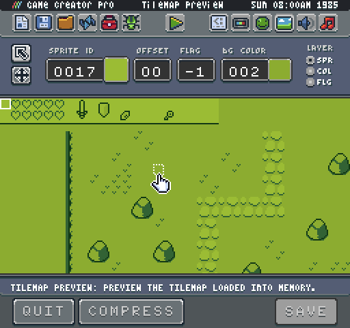
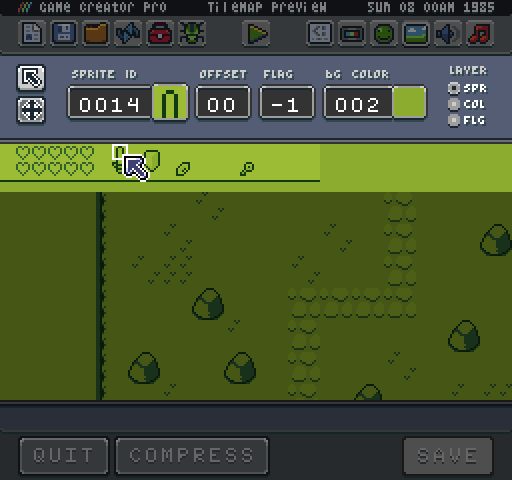
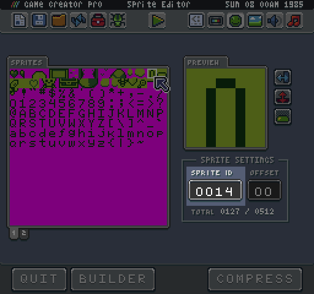
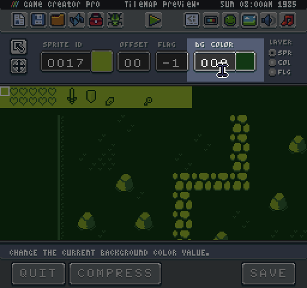
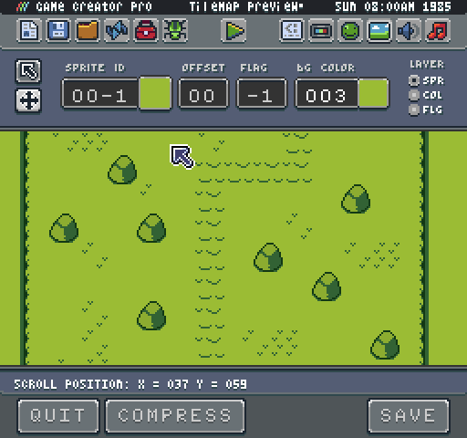

# Tilemap Editor (Pro Only)

The Game Creator has a useful but straightforward tilemap editor which is designed to help you debug any issues you find in your game.

While some of the features of the Tilemap Editor are still being worked on, the core functionality allows you to select tiles, manipulate their values and preview the entire tilemap. When the tool is first loaded, it starts off in edit mode. This allows you to select a tile and view its sprite ID, color offset (which is not entirely functioning yet) and the flag ID.

You can manually change the sprite ID by entering a valid number. While this is helpful for changing a few tiles by hand, the ideal workflow is to make your changes in the tilemap.png or use an external editor such as Tiled. You can get the sprite IDs from the Sprite Editor.

You can also change a tile’s flag ID. Flags are used for collision detection during runtime, and most default game templates allow up to 16 flags (0 - 15). By default, the value for a flag is set to -1. You can clear a flag value by giving the flag input field focus, which clears the current value, then click outside of the field, and it will be set back to -1.

In addition to changing tile values, you can also change the global background color for a tilemap here as well without having to load the Chip Editor.

After making changes, you will need to save them before exiting the tool. You can also compress the tilemap data and create a tilemap.json file which can be loaded in Tiled to work on a tilemap externally. Compressing the tilemap will also create a sprites.cache.png file and a flags.png file which allows you to preview each of the flag colors for making changes to your tilemap-flags.png file in an external image editor.

Finally, you can scroll the tilemap around in the Tilemap Editor by switching over to the pan tool.

When scrolling the tilemap, you’ll be able to preview the scroll position’s x and y values at the bottom of the screen. This is helpful for finding a position to move the map to in your own game and to make sure that the entire tilemap is displaying correctly.


