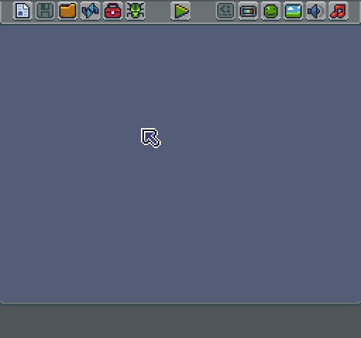
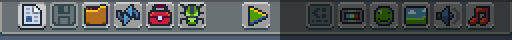
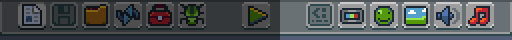
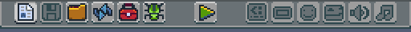

# The Tool Bar

The Tool Bar represents the strip of icons across the top of the edit mode. Each tool or action assists with building Pixel Vision 8 games.

Let us start with the left side of the toolbar. These are the tools included with the free version of Game Creator.

From left to right:

1. New project tool - Creates new games, tools, etc.

2. Save - Archives contents of the Workspace's game folder.

3. File Picker Tool - Opens games, tools, etc.

4. Restart - Reloads the current tool.

5. System Settings Tool - Rename game, ext and global settings.

6. Debug Tool - Displays the log.txt file.

7. Play - Loads the contents of the game directory.

On the opposite side are the core editors. The Pro editor includes these tools.

From left to right:

8. Script Tool - Edits the scripts of a currently loaded game.

9. Display Tool - Edit colors, resolution and draw call limits.

10. Sprite Tool - Preview sprites loaded into memory.

11. Tilemap Tool - Preview tilemap loaded in memory.

12. Sound Tool - Create sound effects.

13. Music Tool - Create song loops.

The toolbar hides and shows icons based on if an action is available or if the tool exists. For example, when you launch the editor for the first time and no game is present, the toolbar disables all of the tools on the right-hand side.

If you are using the free version of Game Creator, these tools remain inactive since they not part of the free version.


